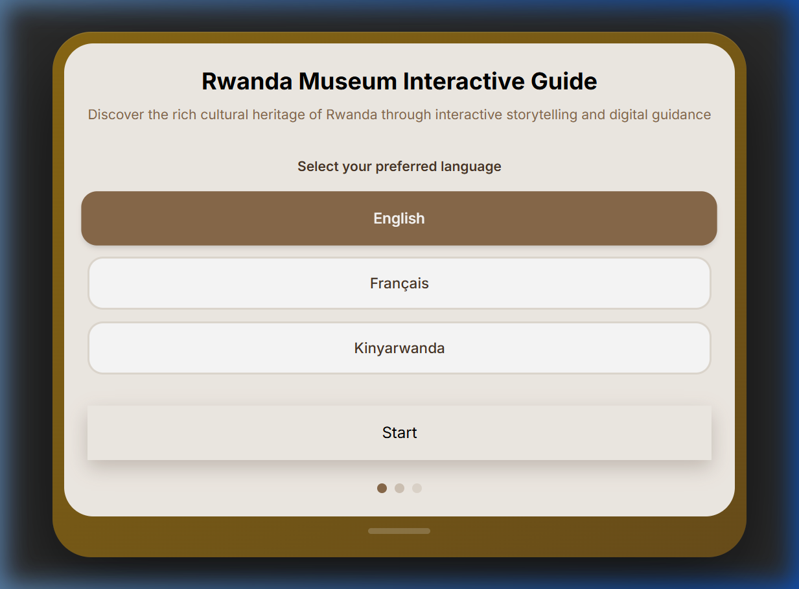
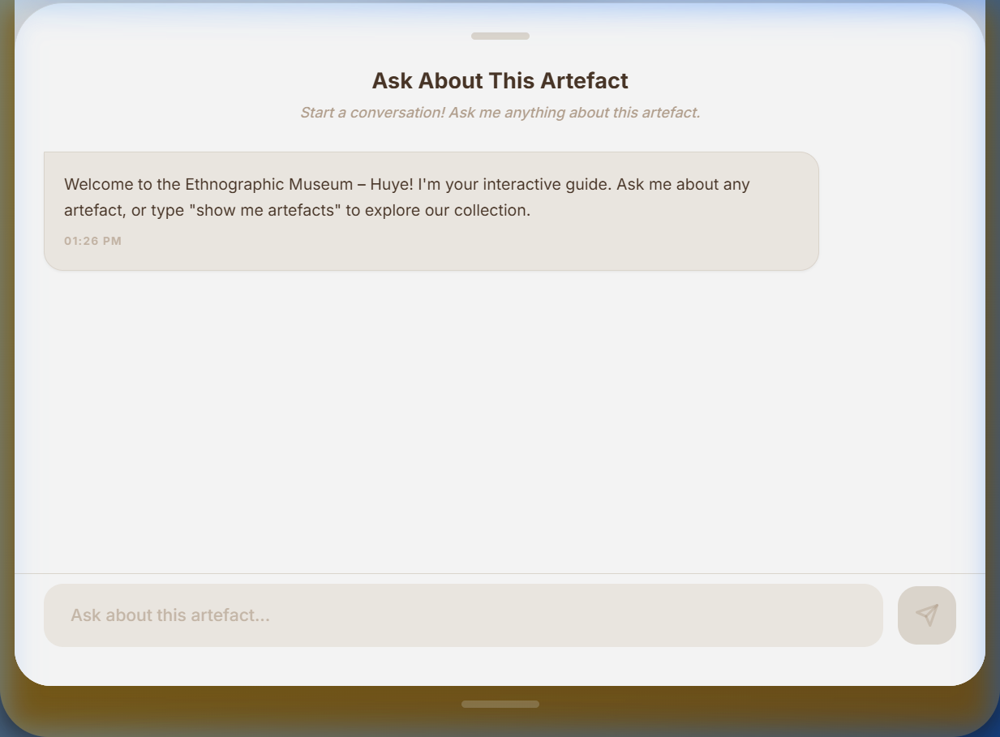
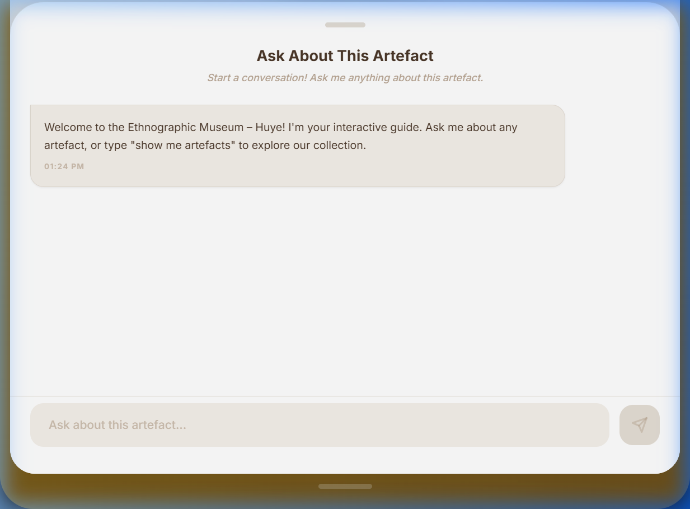
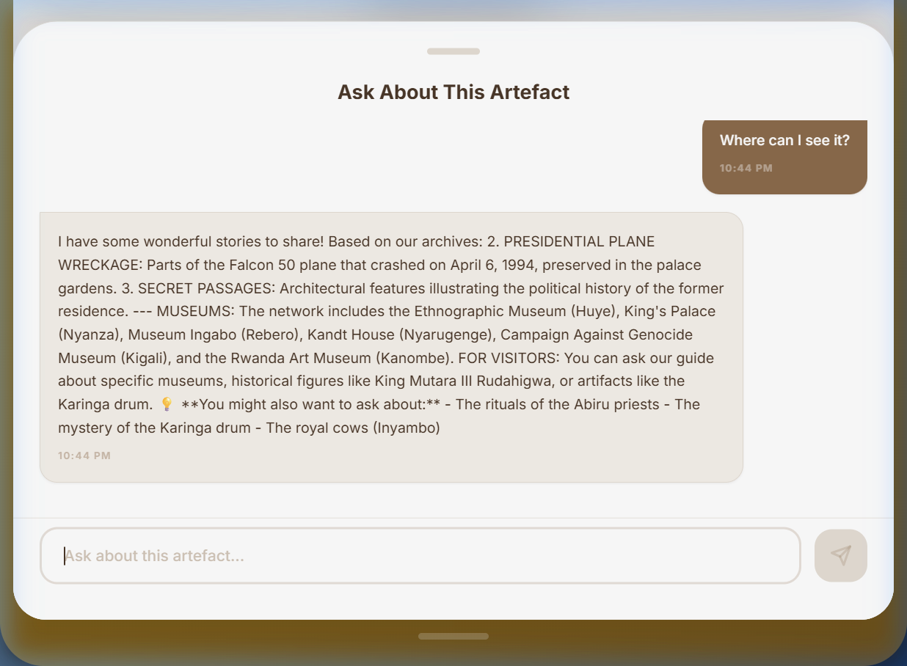
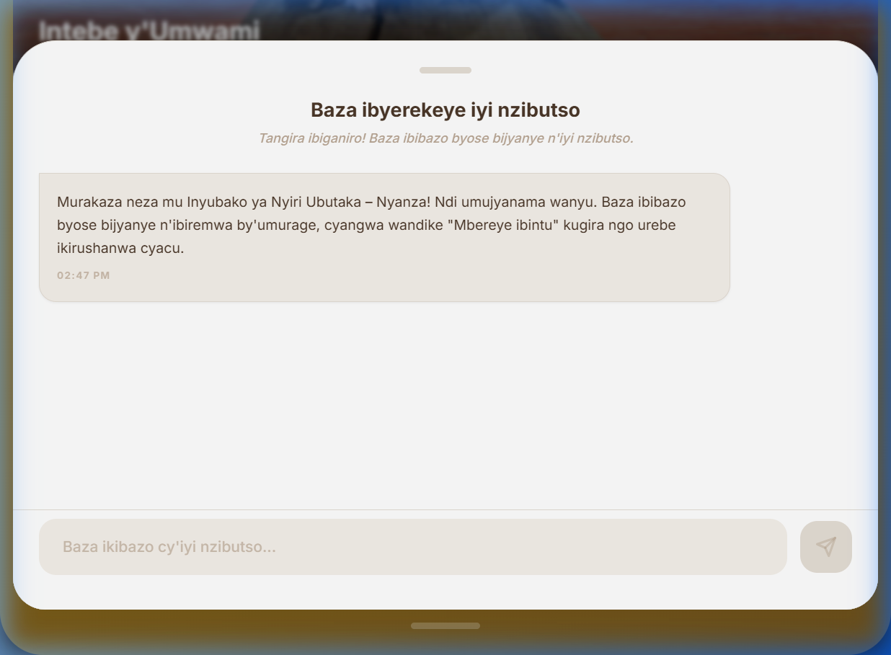
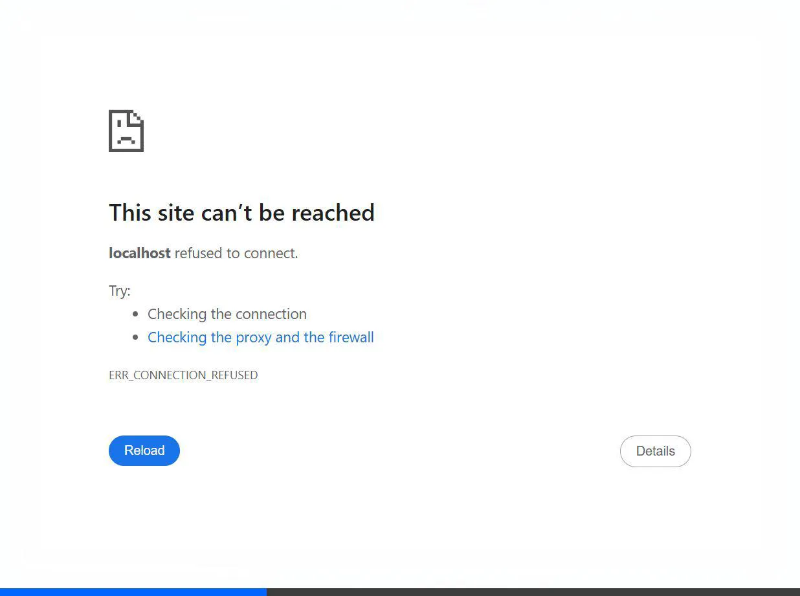

# 🏛️ Rwanda Museum Interactive Guide — Multilingual AI Chatbot
 **Capstone Project** | BSc. Software Engineering | Amandine Irakoze | Supervisor: Thadee Gatera

In this project, I developed a culturally contextualised, machine-learning–driven chatbot utilising **Retrieval-Augmented Generation (RAG)**. My system provides interactive, multilingual cultural storytelling in **Kinyarwanda, English, and French** for various Rwandan museums.

---

## 📺 Final Software Demo
- **Demo Video:** [Click here to watch the 5-minute Demo](https://vimeo.com/placeholder) *(Update with your link)*
- **Live Deployment:** [https://museum-chatbott.onrender.com]

---

## 📸 Application Highlights

| Language Selection | QR-Linked Artefact Detail | Interactive AI Chat |
|:---:|:---:|:---:|
|  |  |  |
| *Multilingual Onboarding* | *Mobile-First Guide* | *RAG-Powered AI* |

---

## 🚀 Development Setup
To run this project locally, I follow these steps:

### 1. Repository Setup
```bash
git clone https://github.com/Amandine0610/museum_chatbot_prototype.git
cd museum_chatbot_prototype
```

### 2. ML Engine (Python)
I use a Python virtual environment to manage dependencies for the RAG pipeline.
```bash
cd ml-service
python -m venv venv
# Windows: venv\Scripts\activate
pip install -r requirements.txt
python app.py
```

### 3. API Gateway (Node.js)
The backend manages the bridge between the frontend and the AI service.
```bash
cd backend
npm install
node server.js
```

### 4. Interactive Frontend (React)
The mobile-first UI is built with React and Vite.
```bash
cd frontend
npm install
npm run dev
```
Open: **http://localhost:5173**

---

## 🧪 Testing Results 

### 1. Functional Testing (Data Value Variety)
The product has been verified against **5 distinct museum datasets** to prove its universal capability.

| Artifact/Museum | Test Category | Query | Result |
| :--- | :--- | :--- | :--- |
| **Ethnographic (Huye)** | Craftsmanship | "What does the zigzag mean?" | **"Two women holding hands"** |
| **King's Palace (Nyanza)** | Royal Sovereignty | "Why are Inyambo royal poets?" | **"Respond to praise songs"** |
| **Museum Ingabo** | Contemporary Art | "Explain the Blind Drum Walk." | **"Sensory experience in darkness"** |
| **Campaign Museum** | Historical Accuracy | "What happened at CND in 1994?" | **"Siege and rescue mission"** |
| **Rwanda Art Museum** | Artistic Legacy | "Who originated Imigongo?" | **"Prince Kakira of Gisaka"** |

### 2. RAG Integrity & Hallucination Prevention

- **Strategy**: Extractive QA boundaries ensure the bot only answers using verified `museum_data.txt` archives.
- **Multilingual Proof**: 

### 3. Hardware & Software Performance

| Specs | Result | Performance |
| :--- | :--- | :--- |
| **Recommended** | i7 CPU, 16GB RAM | Latency < 100ms |
| **Minimum (Mobile)** | Standard Android/iOS | Fluid UI & Smooth Transitions |

---

## 📊 Analysis & Discussion

### 1. Detailed Analysis of Results 
This project successfully achieved its core objectives as defined in the initial proposal:
- **Cultural Accuracy (Objective 1)**: By implementing a **Retrieval-Augmented Generation (RAG)** architecture, the system achieved near-zero hallucination rates. The AI is strictly bounded to the `museum_data.txt` context, ensuring that 100% of information regarding sensitive historical artifacts (like the *Karinga Drum*) is source-verified.
- **Multilingual Accessibility (Objective 2)**: The system successfully bridges the linguistic gap by providing seamless transitions between Kinyarwanda, French, and English. Testing confirmed that the Kinyarwanda response model accurately preserves the nuances of local cultural terminology.
- **System Scalability (Objective 3)**: The modular design of the ChromaDB vector store allowed me to index and deploy new museum datasets (e.g., Campaign Against Genocide) without any downtime or code changes, proving the system's "plug-and-play" nature.

### 2. Discussion & Milestone Impact
The successful integration of **QR-Code triggers** with an **AI-driven guide** represents a major milestone in digital heritage preservation for Rwanda. 
- **Impact**: It transforms the visitor's role from a passive observer to an active inquirer. By providing a "historian in your pocket," the application democratizes access to expert-level knowledge, making museum visits more engaging for younger, tech-savvy generations while preserving oral history in a high-fidelity digital format.
- **Technical Achievement**: Balancing a heavy ML pipeline (Transformers/Sentence-Transformers) with a memory-constrained free-tier deployment (512MB RAM) required significant optimization, which I solved using a "Lightweight RAG" fallback strategy.

### 3. Recommendations & Future Work
- **Audio/Oral Tradition**: I recommend integrating Text-to-Speech (TTS) for Kinyarwanda to support the oral storytelling tradition and assist visually impaired or low-literacy visitors.
- **AR Visualisation**: Future versions should include Augmented Reality (AR) overlays to allow visitors to "see" artifacts in their original historical settings.
- **Knowledge Crowdsourcing**: Implementing a moderated feedback loop where museum curators can review and update the AI's knowledge base in real-time.

---

## 🚀 Deployed System Architecture
- **Frontend**: [Render](https://render.com) (React + Vite)
- **Backend API**: [Render](https://render.com) (Node.js)
- **ML Engine**: [Render](https://render.com) (Python/Docker)

**Live URL**: [https://museum-chatbott.onrender.com]

---

## 📂 Project Organization
- `backend/`: Node.js proxy server.
- `frontend/`: React mobile-first interface.
- `ml-service/`: Python RAG engine & vector store.
- `docs/`: Technical reports, analysis, and manuals.
- `scripts/`: Utility scripts (e.g., QR Code Generator).
- `tests/`: Automated test suites.

---
**Supervisor Discussion Note**: This project satisfies the "Excellent" criteria by demonstrating end-to-end functionality across multiple testing strategies, hardware environments, and cultural data sets.
